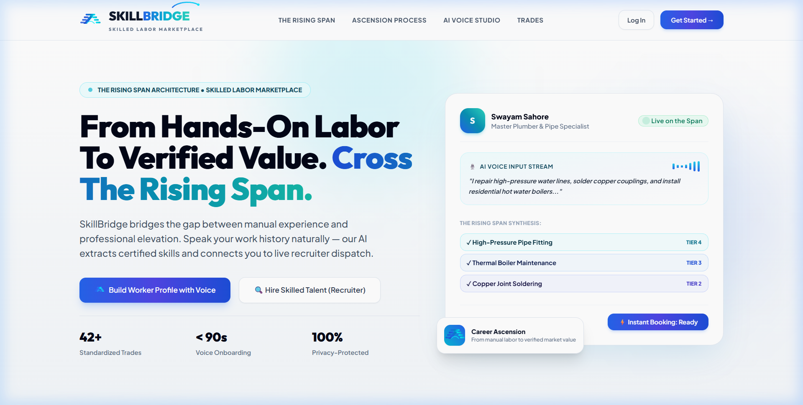
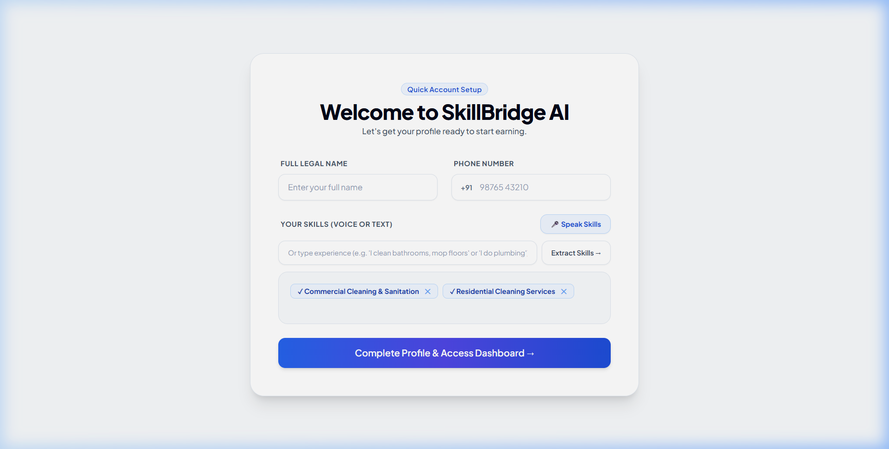
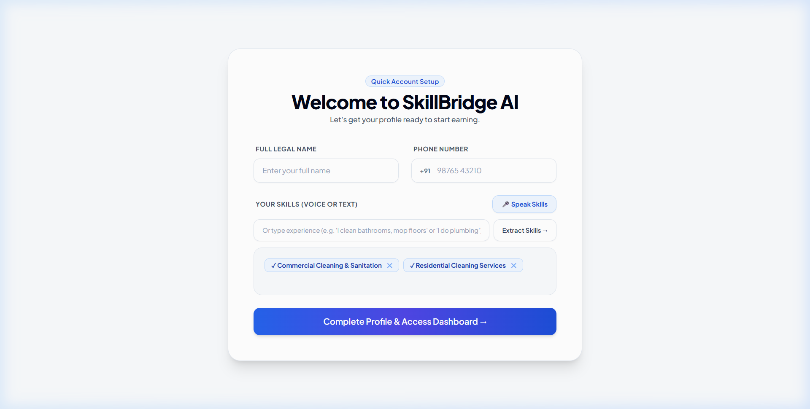
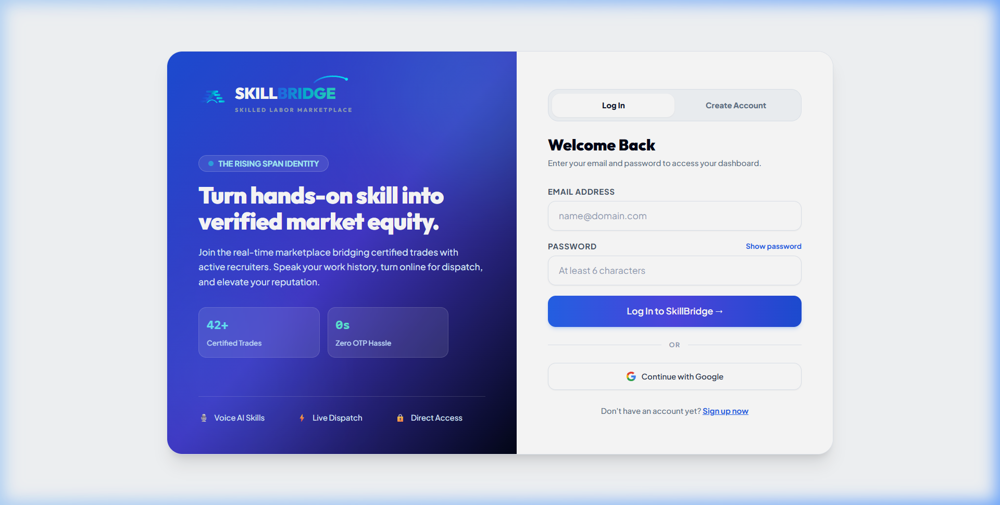

# SkillBridge 🌉
### Skilled Labor Marketplace with Voice-Based Onboarding & NLP Skill Matching

[](https://skillbridge-ai-ochre.vercel.app/)
[](https://github.com/swayam-248/skillbridge-ai/actions)
[](https://react.dev/)
[](https://nodejs.org/)
[](https://expressjs.com/)
[](https://www.mongodb.com/)
[](https://compromise.cool/)
[](LICENSE)

**SkillBridge** is an on-demand, two-sided marketplace connecting hands-on tradespeople with recruiters, property managers, and homeowners. It replaces cumbersome resume forms with hands-free voice onboarding using the Web Speech API and rule-based NLP skill matching (Compromise NLP), paired with live availability dispatch and a concurrency-safe booking lifecycle.

---

## 📸 Application Preview

<table width="100%">
  <tr>
    <td width="50%">
      <p align="center"><b>1. Landing & Brand Elevation</b></p>
      
    </td>
    <td width="50%">
      <p align="center"><b>2. Entity-Aware NLP Skill Extraction</b></p>
      
    </td>
  </tr>
  <tr>
    <td width="50%">
      <p align="center"><b>3. Worker Workspace & Live Radar Dispatch</b></p>
      
    </td>
    <td width="50%">
      <p align="center"><b>4. Secure Authentication & Role Portals</b></p>
      
    </td>
  </tr>
</table>

---

## 🎯 What It Solves (The Core Story)

Tradespeople often lack polished digital resumes, while contractors and facility managers struggle to find qualified, available workers on demand:

1. **Hands-Free Voice Onboarding:** Workers speak naturally about what they do (*"I fix pipe leaks and unclog bathroom drains"*). The browser's **Web Speech API** captures the voice stream, and a client-side NLP pipeline extracts domain entities and classifies them against 42 standardized trades.
2. **On-Demand Dispatch:** Recruiters search by problem description (*"water leaking under kitchen sink"*) or browse available workers. Workers toggle **Online / Offline** availability in real time.
3. **Privacy Gating:** Contact details (phone numbers and direct contact info) remain masked until a worker explicitly accepts a job booking.
4. **Concurrency-Safe Bookings:** Bookings follow a strict finite state machine backed by atomic MongoDB conditional updates to eliminate race conditions and double-bookings.

---

## 🔬 How NLP Skill Matching Actually Works (No Buzzword Hype)

Rather than relying on opaque cloud LLM calls, SkillBridge uses a deterministic, privacy-friendly, zero-cost NLP pipeline:

```
[ User Speech / Text Input ]
             │
             ▼
[ Browser Web Speech API ] ──► Raw Transcript: "I clean bathrooms and scrub tiles"
             │
             ▼
[ Compromise NLP (v14) ]
   ├── Tokenization & Root Stemming ("cleaning" -> "clean", "bathrooms" -> "bathroom")
   ├── Conversational Stopword Pruning ("I", "and", "the")
   └── Generic Verb Damping (Verbs like "clean", "fix", "repair" don't trigger trades alone)
             │
             ▼
[ Domain Entity & Synonym Scoring ]
   ├── Matches Domain Entity: "bathroom" / "toilet" / "restroom" ──► Sanitation & Cleaning (+10.0)
   └── Filters Out False Positives: Painting, Electrical, or Food Prep remain at 0.0 score
             │
             ▼
[ Verified Trade Credential Mapping ] ──► Auto-selects verified trade badges
```

- **Entity vs. Generic Action Filtering:** Words like `clean`, `fix`, and `repair` apply across dozens of trades. SkillBridge classifies them as generic actions, requiring a specific domain entity (`pipe`, `wire`, `bathroom`, `drywall`) before activating a skill match.
- **Synonym Expansion:** Maps conversational speech terms (`toilet`, `washroom`, `lavatory`) to standardized industry taxonomies.

---

## 🔄 Booking Lifecycle & Concurrency Model

A common failure mode in marketplace apps is double-booking: two recruiters booking the same worker at the exact same moment, or a worker accepting a cancelled job. SkillBridge prevents this using a strict finite state machine with database-level atomic operations.

### State Transition Diagram

```
                 ┌───────────────┐
                 │    Pending    │
                 └───────┬───────┘
            Worker       │       Worker or
            Accepts      │       Recruiter Cancels
            ┌────────────┴────────────┐
            ▼                         ▼
    ┌───────────────┐         ┌───────────────┐
    │   Accepted    │         │   Cancelled   │ [Terminal State]
    └───────┬───────┘         └───────────────┘
Worker or   │       Worker or
Recruiter   │       Recruiter Cancels
Completes   │
    ┌───────┴───────┐
    ▼               ▼
┌───────────────┐ ┌───────────────┐
│   Completed   │ │   Cancelled   │ [Terminal State]
└───────────────┘ └───────────────┘
[Terminal State]
```

### Atomic Compare-And-Swap (CAS) Protection

Instead of non-atomic read-then-write updates, status transitions execute through MongoDB's atomic `findOneAndUpdate` with a status predicate:

```javascript
// Server/index.js - Atomic Transition
const updatedBooking = await Booking.findOneAndUpdate(
  {
    _id: req.params.id,
    status: existing.status // Ensures atomic CAS; fails if status changed concurrently
  },
  { $set: updateData },
  { new: true }
);

if (!updatedBooking) {
  return res.status(409).json({
    message: "Concurrent update conflict: Booking status was already modified by another action."
  });
}
```

- If a concurrent request modifies the booking between read and write, the update returns `null` and responds with an HTTP `409 Conflict`.
- Terminal states (`completed`, `cancelled`) reject any further transition attempts.

---

## 🛡️ Security Architecture

| Vector | Threat | SkillBridge Mitigation |
| :--- | :--- | :--- |
| **Google OAuth** | Token leak via URL / Referer header | **One-time code exchange:** Google callback returns a short-lived (60s), single-use `code`. The client exchanges it via `POST /api/auth/exchange-code` over HTTPS. The JWT never enters URL query parameters or browser history. |
| **Passwords** | Database credential exposure | Hashed with `bcryptjs` using 10 salt rounds before storage. |
| **Worker Privacy** | Scraped worker contact numbers | Direct phone numbers are gated at the schema level and only revealed to recruiters after an `accepted` status. |
| **Session Auth** | Unauthenticated API access | Role-scoped JWTs (`worker` / `recruiter`) verified with Bearer token middleware on all mutation endpoints. |

---

## 🏗️ System Architecture

```
┌──────────────────────────────────────────────────────────────────────────────┐
│                              CLIENT (Vite + React 19)                        │
├───────────────────────┬──────────────────────────────┬───────────────────────┤
│    LANDING PAGE (/)   │     WORKER WORKSPACE         │  RECRUITER WORKSPACE  │
│  • The Rising Span    │  • Voice Studio & NLP Engine │  • Problem Matcher    │
│  • Trade Elevation    │  • Standardized Skill Badges │  • Available Workers  │
│  • Category Showcase  │  • Availability Radar Beacon │  • Privacy Gated Cards│
│  • Interactive Audio  │  • Booking Lifecycle Inbox   │  • Escrow Reviews     │
└───────────────────────┴──────────────┬───────────────┴───────────────────────┘
                                       │ REST API (Bearer JWT / JSON)
                                       ▼
┌──────────────────────────────────────────────────────────────────────────────┐
│                       BACKEND (Node.js 22 + Express 5)                       │
├──────────────────────┬───────────────────────────────┬───────────────────────┤
│   AUTH CONTROLLER    │      PROFILES & DISPATCH      │   BOOKINGS & REVIEWS  │
│  • Email + Password  │  • Worker Dossier API         │  • Atomic State CAS   │
│  • One-Time OAuth    │  • 42 Standardized Skills     │  • Duplicate Gating   │
│  • Code Exchange     │  • Online / Offline Radar     │  • 5-Star Reviews     │
└──────────────────────┴──────────────┬────────────────┴───────────────────────┘
                                       │ Mongoose ODM
                                       ▼
┌──────────────────────────────────────────────────────────────────────────────┐
│                          DATABASE (MongoDB Atlas)                            │
│    Collections: Users | Profiles | Skills (42) | Bookings | Reviews | Jobs   │
└──────────────────────────────────────────────────────────────────────────────┘
```

---

## 🔌 API Reference

### Authentication
| Method | Endpoint | Description |
| :--- | :--- | :--- |
| `POST` | `/api/auth/register` | Register new worker or recruiter with email & password |
| `POST` | `/api/auth/login` | Authenticate with email & password; returns JWT token |
| `POST` | `/api/auth/exchange-code` | Exchange single-use OAuth code for session JWT (no tokens in URL) |
| `GET` | `/api/auth/google` | Initiate Google OAuth 2.0 flow |
| `GET` | `/api/auth/google/callback` | OAuth redirect callback producing one-time code |

### Profiles & Talent Pool
| Method | Endpoint | Description |
| :--- | :--- | :--- |
| `GET` | `/api/profiles` | List verified workers with optional trade filter |
| `GET` | `/api/profiles/:userId` | Fetch worker profile dossier with ratings and review history |
| `POST` | `/api/profiles` | Update worker profile (skills, bio, contact information) |
| `PUT` | `/api/profiles/status` | Toggle live radar availability (`isOnline: true/false`) |
| `GET` | `/api/skills` | Fetch 42 standardized trade skill definitions |

### Bookings & Reviews
| Method | Endpoint | Description |
| :--- | :--- | :--- |
| `POST` | `/api/bookings` | Create direct booking; prevents duplicate concurrent requests |
| `GET` | `/api/bookings` | Fetch user bookings with populated worker/recruiter data |
| `PUT` | `/api/bookings/:id/status` | Atomic state transition (`pending` → `accepted` → `completed`/`cancelled`) |
| `POST` | `/api/reviews` | Submit verified 1–5 star review (gated to completed bookings) |

---

## 🧪 Automated Testing & CI

Unit tests verify the state machine transitions and race condition simulations using Node.js's native test runner (`node:test`):

```bash
# Run backend test suite
npm test
```

### Test Coverage Highlights:
- ✅ Worker can accept a pending booking.
- ✅ Recruiter cannot accept on behalf of worker (403 Forbidden).
- ✅ Cancelling allowed from pending and accepted states.
- ✅ Direct jump from pending to completed is rejected (400 Bad Request).
- ✅ Terminal states (`completed`, `cancelled`) cannot be modified.
- ✅ Identical same-state transitions are rejected.
- ✅ Unauthorized third-party users cannot alter bookings (403 Forbidden).
- ✅ Atomic Compare-And-Swap simulation verifies race-condition prevention.

Continuous Integration runs automatically via **GitHub Actions** on every push to `main` (`.github/workflows/ci.yml`), executing the test suite and verifying the client production build.

---

## 💻 Local Development Setup

SkillBridge is organized as an **npm workspace monorepo**:

### 1. Clone & Install
```bash
git clone https://github.com/swayam-248/skillbridge-ai.git
cd skillbridge-ai
npm install
```

### 2. Environment Variables
Create a `Server/.env` file:
```env
PORT=5000
MONGO_URI=mongodb+srv://<username>:<password>@cluster.mongodb.net/skillbridge
JWT_SECRET=your_jwt_secret_key_here
CLIENT_URL=http://localhost:5173

# Optional: Google OAuth
GOOGLE_CLIENT_ID=your_google_client_id
GOOGLE_CLIENT_SECRET=your_google_client_secret
```

### 3. Seed Trade Skills
Populate MongoDB Atlas with the 42 verified trade skill models:
```bash
npm run seed
```

### 4. Run Development Servers
Start both the Vite frontend and Express backend concurrently:
```bash
npm run dev
```

- **Frontend Application:** `http://localhost:5173`
- **Backend API Server:** `http://localhost:5000`
- **Health Check Endpoint:** `http://localhost:5000/api/health`

---

## 🚀 Deployment

The repository includes a root `vercel.json` supporting single-project monorepo deployment:
- **Build Command:** `npm run build`
- **Output Directory:** `Client/dist`
- **API Function:** `api/index.js` (Express backend serverless adapter)
- **Live URL:** [skillbridge-ai-ochre.vercel.app](https://skillbridge-ai-ochre.vercel.app/)

---

## 📄 License
This project is licensed under the [ISC License](LICENSE).